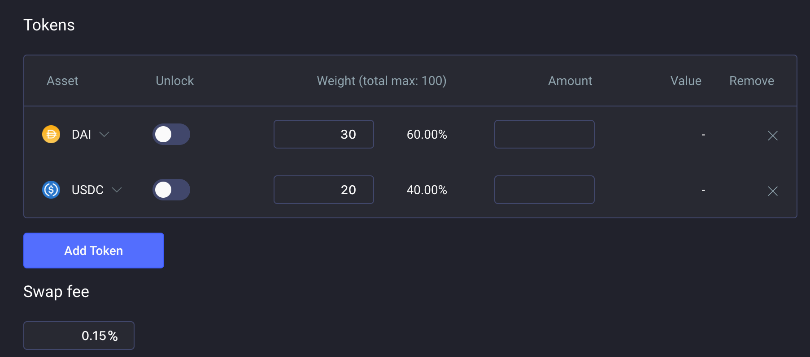

# Creating a Shared Balancer Pool

## Setting up a proxy

All the interactions to add liquidity or to create Balancer pools on our UIs happen through a proxy. This way our UI can simplify the UX by avoiding token approvals on every new pool the user interacts with.

You'll be asked to setup a proxy when your address is interacting with our UI for the first time. For example, when you click on "Create Pool" on our [pool management interface](https://pools.balancer.exchange/#/):

After clicking on "Create Pool," you'll see the setup button:

The proxy setup waits for 10 confirmations to be extra safe.

An interesting observation: we use the same DSProxy smart contracts as MakerDAO, so if you have an MCD vault already you won't need to create another proxy!

### Shared Pool Creation

At the moment you can only create **shared pools** on our UI. There will be soon the option to create and manage private pools. As a reminder:

* **shared pools** are open to anyone to join by adding liquidity and getting BPTs \(Balancer Pool Tokens\) in return, but all the pool parameters are immutable
* **private pools** only allow the owner to add liquidity to the pool, but all its parameters are flexible. So the owner of the private pool can change the swap fees, pause trades, add/remove tokens, change token weights, etc.

A Balancer pool allows up to 8 tokens and the weights have to be between 2% and 98%. The swap fee can be between 0.0001% and 10%.

If the token you want to add is not listed on the token picker panel, you can add any custom token by pasting its address in the search field.

**IMPORTANT**: make sure that the custom token you are adding complies with the ERC20 standard. For example it has to allow 0 value transfers and the transfer function must return a boolean. You can check if the token you are adding is on any of these two lists that gather many tokens that are not ERC20-compliant:





These lists though are **NOT** exhaustive, so make sure you check your token is compatible before creating a pool with it to avoid losing your tokens forever.

