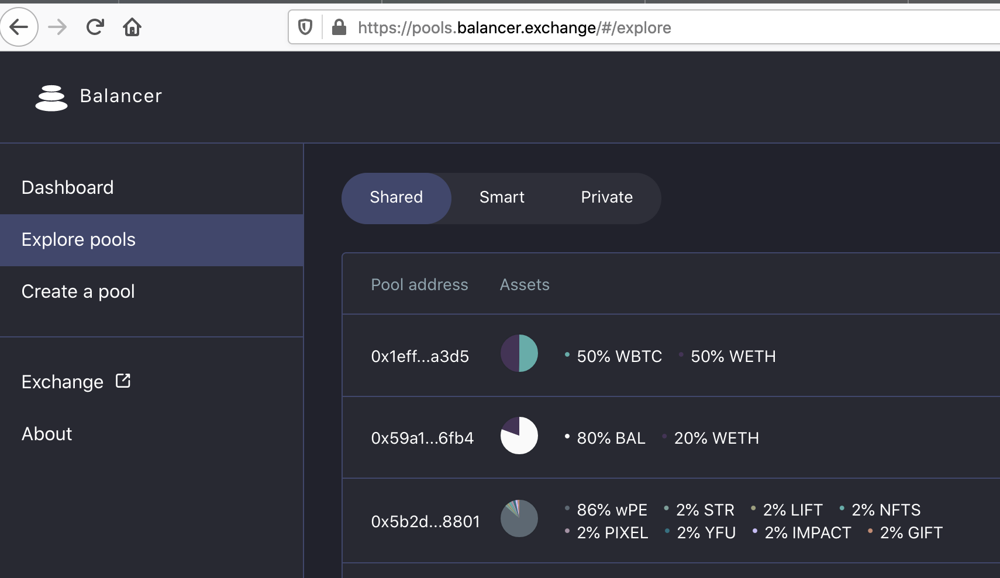

# Creating a Shared Pool

## This page has been deprecated. V1 documentation is partially maintained [here](https://docs.balancer.fi/v/v1/guides/creating-a-balancer-pool)

## Creating a Shared Pool

### Setting up a proxy

All the interactions to add liquidity or to create Balancer pools on our UIs happen through a proxy. This way our UI can simplify the UX by avoiding token approvals on every new pool the user interacts with.

You'll be asked to setup a proxy when your address is interacting with our UI for the first time. For example, when you click on "Create a Pool" on our [pool management interface](https://pools.balancer.exchange/#/):

Select "Shared" to create a shared pool. After clicking on "Create a Pool," you'll see the "Setup Proxy" button at the bottom, if it's the first time:

The proxy setup waits for 10 confirmations to be extra safe. Note that proxy contracts are deployed for each address you use \(i.e., if you switch to another account, it will prompt you to create a proxy again\). Since proxy deployment is fairly expensive - though it saves you gas in the long run - think carefully before you create a proxy, and make sure you are using the address you want to use! If you're going to create an LBP funded with millions of dollars, you'll probably want to use a MultiSig hardware wallet, not your Metamask "hot" wallet.

An interesting observation: we use the same DSProxy smart contracts as MakerDAO, so if you have an MCD vault already you won't need to create another proxy!

There is only one "action" button. If you have already set up a proxy with this address, the system will skip the setup step and next check to see if you have "approved" the proxy for the tokens you want to transfer. If not, the button will say "Unlock &lt;token name&gt;" for each token. If you just created the proxy, it will prompt you to unlock each token \(BAL, then WETH for the sample pool shown above\), requiring you to send a transaction to approve each token.

Once all tokens have been approved, the button will say "Create," and pressing it will create the transaction to deploy and fund the pool.

#### Shared Pool Creation

* **shared pools** are open to anyone to join by adding liquidity and getting BPTs \(Balancer Pool Tokens\) in return, but all the pool parameters are immutable
* **private pools** only allow the owner to add liquidity to the pool, but all its parameters are flexible. So the owner of the private pool can change the swap fees, pause trades, add/remove tokens, change token weights, etc.

A Balancer pool allows up to 8 tokens and the weights have to be between 2% and 98%. The swap fee can be between 0.0001% and 10%.

You can enter any numbers you like in the weights field, though it's easiest to simply type the percentages directly. The input values will be converted to percentages, and then denormalized to pass to the contract factory. For instance, 90/10 would be denormalized to 45e18/5e18 \(i.e., 90% of the max total weight of 50, in wei, is 45e18\).

**Similar Pools**

Note the "similar pools" information block in the example above. If there are already pools with the same tokens with similar weights, it might be better to add liquidity to those instead of creating a new pool. We discourage having many similar pools, since it fragments liquidity and leads to higher slippage for traders. Large liquidity pools \(especially with relatively low fees\), provide the best experience for traders. It has also become quite expensive to deploy pools in this era of all-time high ETH and gas prices!

**Amounts entry**

By default \(with the padlock "locked"\), the interface uses a CoinGecko price feed to assist in calculating the token amounts given the weights.

If there is no price feed \(e.g., for a custom token\), or you believe it is inaccurate, you can click the padlock to "unlock" the amounts. This will disable the price feed calculation and allow you to type in any amount you like.

When you actually create the pool, the system will display the internal prices that will be visible on the exchange \(based on the weights and balances, per the AMM logic\), and ask you to confirm. This is very important! The system will allow you to create a pool with any arbitrary prices, but if those prices deviate from the current market rates, arbitrageurs will trade against the pool until the prices do match, potentially draining much of its value.

If the token you want to add is not listed on the token picker panel, you can add any custom token by pasting its address in the search field.

**IMPORTANT**: make sure that the custom token you are adding complies with the ERC20 standard. For example it has to allow 0 value transfers and the transfer function must return a boolean. You can check if the token you are adding is on any of these two lists that gather many tokens that are not ERC20-compliant:





These lists though are **NOT** exhaustive, so make sure you check your token is compatible before creating a pool with it to avoid losing your tokens forever.

