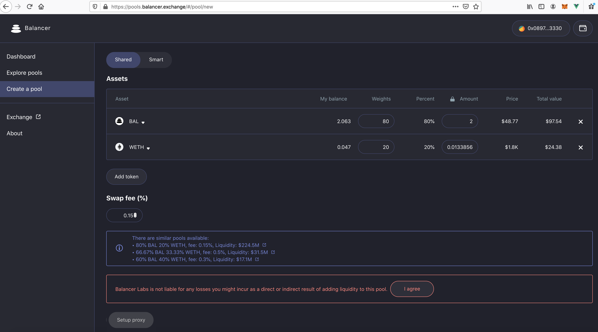
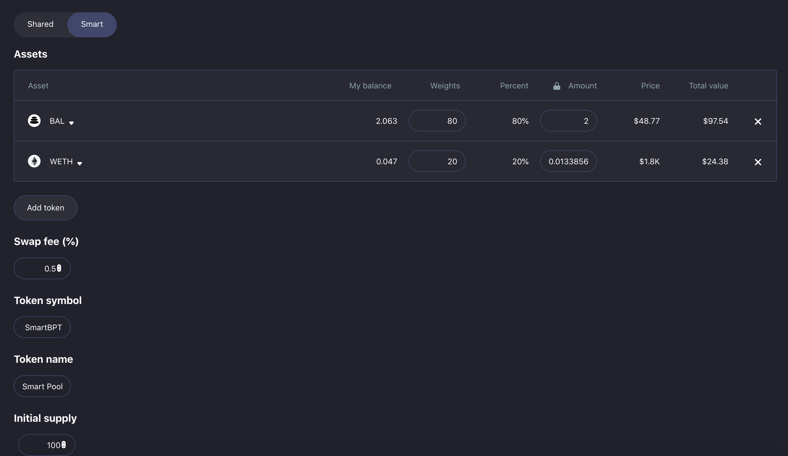
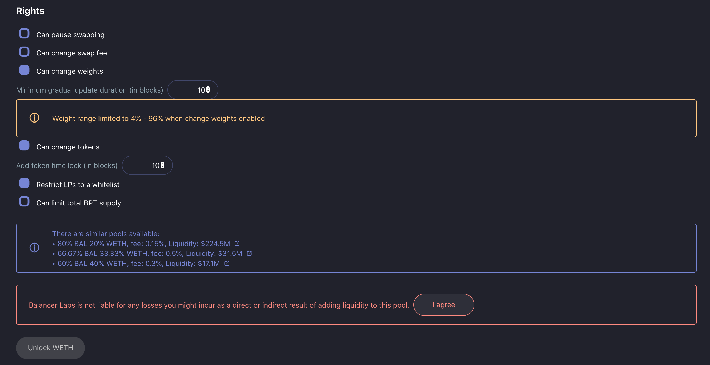
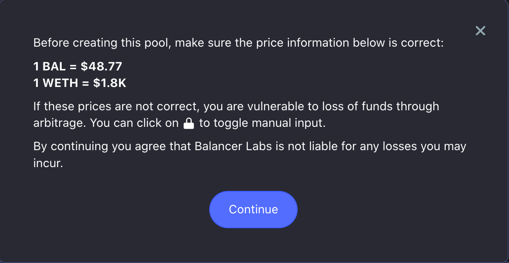

# Creating a Smart Pool

## This page has been deprecated. V1 documentation is partially maintained [here](https://docs.balancer.fi/v/v1/guides/creating-a-smart-pool)

## Creating a Smart Pool

### Setting up a proxy

All the interactions to add liquidity or to create Balancer pools on our UIs happen through a proxy. This way our UI can simplify the UX by avoiding token approvals on every new pool the user interacts with.

You'll be asked to setup a proxy when your address is interacting with our UI for the first time. For example, when you click on "Create a Pool" on our [pool management interface](https://pools.balancer.exchange/#/):

The proxy setup waits for 10 confirmations to be extra safe. Note that proxy contracts are deployed for each address you use \(i.e., if you switch to another account, it will prompt you to create a proxy again\). Since proxy deployment is fairly expensive - though it saves you gas in the long run - think carefully before you create a proxy, and make sure you are using the address you want to use! If you're going to create an LBP funded with millions of dollars, you'll probably want to use a MultiSig hardware wallet, not your Metamask "hot" wallet.

An interesting observation: we use the same DSProxy smart contracts as MakerDAO, so if you have an MCD vault already you won't need to create another proxy!

There is only one "action" button. If you have already set up a proxy with this address, the system will skip the setup step and next check to see if you have "approved" the proxy for the tokens you want to transfer. If not, the button will say "Unlock &lt;token name&gt;" for each token. If you just created the proxy, it will prompt you to unlock each token \(BAL, then WETH for the sample pool shown above\), requiring you to send a transaction to approve each token.

Once all tokens have been approved, the button will say "Create," and pressing it will create the transaction to deploy and fund the pool.

#### Smart Pool Creation

Smart pools are intermediate between **private** and **shared** pools \(described in [Creating a Shared Pool\)](creating-a-balancer-pool.md). Unless restricted by policy \(more on that later\), smart pools allow public LPs, yet their parameters are not fixed. They can be changed by the controller \(usually the account that deployed the pool\) - but only in certain ways that are configured on deployment and thereafter immutable.

These are called "Rights" \(hence the name "Configurable Rights Pool"\), and reserving a right allows the controller to alter the corresponding parameter.

Select the "Smart" toggle to create a smart pool. Unlike with shared pools, you can set a custom token symbol and name; this will be the BPT \(pool token\), representing shares in the pool. Each pool **is** a token contract. You can also specifiy the initial supply of the token, which is arbitrary \(within the protocol limits of 100 - 1 billion\).

Creating a smart pool requires setting the "rights" the pool will have \(and associated parameters\), according to the [purpose of the pool](smart-pool-templates-gui/).

* Can pause swapping - the controller can halt trading. This was originally a "panic button," but is more commonly used to delay the start of a liquidity bootstrapping pool - or to prevent arbitrage trades while adjusting weights. All pools start "unpaused" when deployed.
* Can change swap fee - the controller can alter the swap fee after deployment, still subject to the protocol limits \(0.0001% to 10%\)
* Can change weights - the controller can either change weights arbitrarily \(which transfers tokens to keep the prices constant\), or set a schedule for the weights to change linearly over time - the heart of the [Liquidity Bootstrapping Pool](../smart-contracts/smart-pools/liquidity-bootstrapping-faq.md). Another important parameter is the minimum duration. The controller cannot initiate a gradual weight change that happens faster than this duration. \(Faster weight change = more trust required.\)
* Can add/remove tokens - the controller can add a new token through a two-stage process that involves a timelock. The minimum "add token timelock" period is also specified on deployment. This is a "dangerous" right, since the controller could add a worthless token and drain the pool. \(Public LPs have the timelock period to withdraw if the controller is malicious.\)

The controller can also remove an existing token from the pool, which transfers the entire balance of that token to the controller. Note that the controller must burn BPTs \(pool tokens\) to do this, so if public LPs are allowed, the controller might not have enough BPT to actually do this. It is most commonly used to terminate LBPs.

* Must whitelist LPs - no one can add liquidity to the pool after creation, unless their address is added to  whitelist. This is most commonly used for LBPs and Smart Treasuries.
* Can change cap - this limits the total supply of pool tokens. It is set to the initial supply upon deployment, so no one can add liquidity unless the controller raises the cap. The controller can set the cap to "unlimited," which makes it behave like a shared pool, or 0 \(preventing new LPs altogether\), or any intermediate value.

Setting up the pool tokens proceeds exactly as with shared pools.

You can enter any numbers you like in the weights field, though it's easiest to simply type the percentages directly. The input values will be converted to percentages, and then denormalized to pass to the contract factory. For instance, 90/10 would be denormalized to 45e18/5e18 \(i.e., 90% of the max total weight of 50, in wei, is 45e18\).

**Similar Pools**

Note the "similar pools" information block in the example above. If there are already pools with the same tokens with similar weights, it might be better to add liquidity to those instead of creating a new pool. We discourage having many similar pools, since it fragments liquidity and leads to higher slippage for traders. Large liquidity pools \(especially with relatively low fees\), provide the best experience for traders. It has also become quite expensive to deploy pools in this era of all-time high ETH and gas prices!

**Amounts entry**

By default \(with the padlock "locked"\), the interface uses a CoinGecko price feed to assist in calculating the token amounts given the weights.

If there is no price feed \(e.g., for a custom token\), or you believe it is inaccurate, you can click the padlock to "unlock" the amounts. This will disable the price feed calculation and allow you to type in any amount you like.

When you actually create the pool, the system will display the internal prices that will be visible on the exchange \(based on the weights and balances, per the AMM logic\), and ask you to confirm. This is very important! The system will allow you to create a pool with any arbitrary prices, but if those prices deviate from the current market rates, arbitrageurs will trade against the pool until the prices do match, potentially draining much of its value.

If the token you want to add is not listed on the token picker panel, you can add any custom token by pasting its address in the search field.

**IMPORTANT**: make sure that the custom token you are adding complies with the ERC20 standard. For example it has to allow 0 value transfers and the transfer function must return a boolean. You can check if the token you are adding is on any of these two lists that gather many tokens that are not ERC20-compliant:

