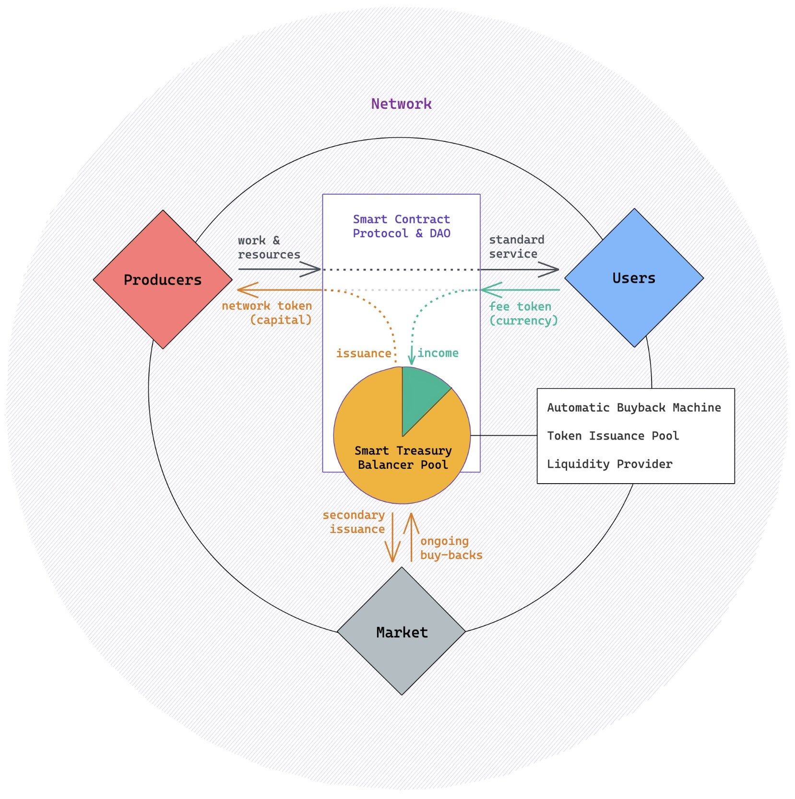

# Smart Treasury

## This page has been deprecated. V1 documentation is partially maintained [here](https://docs.balancer.fi/v/v1/guides/smart-pool-templates-gui/smart-treasury)

## Smart Treasury

This is an emerging use case, based in large part on [this article](https://www.placeholder.vc/blog/2020/9/17/stop-burning-tokens-buyback-and-make-instead) by Placeholder \(see image below, from that article, and the related [simulator](https://drive.google.com/file/d/1xTyQAQgTyl6Ajkl7AYzA6yB_X2H-5RVn/view).\)

Here we have a network of producers and consumers, where users pay for services with a fee token, and that income is used to pay producers in project tokens. Since the treasury is a Smart Pool, excess ETH would raise the price and cause the market to swap in project tokens for ETH until it the treasury is rebalanced - effectively an automatic buyback.

The treasury can also buyback on a schedule by adding liquidity \(e.g., depositing reserve currency income\), and replenishes the market supply through issuance to producers. Maintaining the treasury as a Balancer pool means the market has guaranteed liquidity through the protocol itself.

Legend**: required;** ~~not required;~~ _optional_

**Rights configuration:**

* _canPauseSwapping_
* _canChangeSwapFee_
* ~~canChangeWeights~~
* ~~canAddRemoveTokens~~
* **canWhitelistLPs**
* ~~canChangeCap~~

The Smart Pool Treasury is by definition the only liquidity provider, so the only right you really need is whitelisting \(only the controller would be on the whitelist, enabling buybacks\). Change swap fee could be used to modulate trading to some degree if necessary. If you want to be able to prevent trading against the pool altogether, you could enable pause swapping \(though since this is the mechanism of automatic buyback, it should be used sparingly\).

