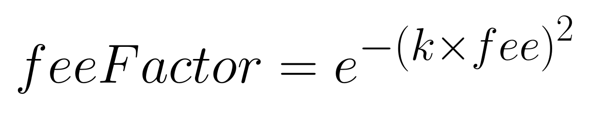
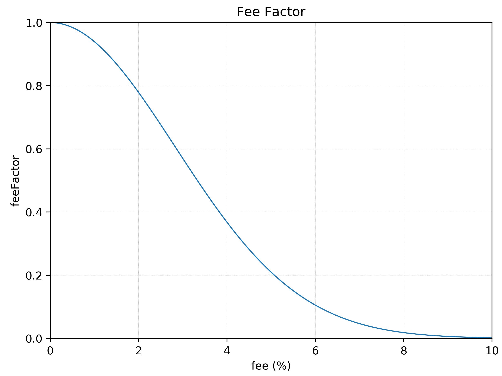

# This page has been deprecated. V1 documentation is partially maintained [here](https://docs.balancer.fi/v/v1/protocol/bal-liquidity-mining/)

# BAL Liquidity Mining

## BAL Distribution Proportional to Liquidity on Balancer 

To make the token distribution as fair as possible, we distribute BAL tokens proportional to the amount of liquidity each address contributed, relative to the total liquidity on Balancer. Since there is liquidity in several different tokens, we use the USD value as the common measure.

Head over to [https://claim.balancer.finance/](https://claim.balancer.finance/) to claim your BAL from liquidity mining.

In practice, every week Balancer Labs has to:

* Define the starting and ending block of the week. Both are chosen as the block with the closest timestamp to a fixed weekly time \(e.g. Sunday 1:00pm UTC\). For example, the starting block for a given week might be \#10,100,000 and the ending block \#10,140,000.
* Define snapshot blocks, every 256 blocks \(roughly hourly\) counting backwards from the ending block until the starting block. For the example above, the snapshot blocks would be \#10,140,000, \#10,139,744, \#10,139,488, and so on.
* For each snapshot block, and for each Balancer pool, get the USD price of the tokens in the pool from [CoinGecko](https://www.coingecko.com/api/documentations/v3#/contract/get_coins__id__contract__contract_address__market_chart_), and calculate the total USD liquidity.
* Since liquidity in pools that have lower trading fees contribute more to protocol usage than liquidity in pools with higher fees, we multiply the USD pool liquidity by a feeFactor that down-weights pools according to their fee percentage:

The constant, `k`, was initially set to 0.5, but beginning in week 8 \(July 20th 00:00 UTC\), the community approved a [proposal to to change `k` to 0.25](https://forum.balancer.finance/t/modifying-feefactor-toward-reducing-the-mining-penalty-for-high-fee-pools/103) in order to ease the penalty for higher-fee pools. This creates the following bell-shaped curve for feeFactor, which means, for example, that a pool with a 0.5% fee has a feeFactor of ~0.98, a pool with a 1% fee has a feeFactor of ~0.94, and a pool with a 2% fee has a feeFactor of ~0.78:

* **UPDATED for week 2** \(starting June 8th 00:00 UTC\), multiply the pool liquidity by a `ratioFactor`. Since pools that are imbalanced contribute less to trading volume \(because the slippage is higher\), the community approved a [proposal to add a ratioFactor](https://forum.balancer.finance/t/introduction-of-a-weight-ratio-factor-in-liquidity-mining/15). This way highly imbalanced pools \(such as those with 98%/2% weights\) have a much lower weight in the final BAL distribution.
* **UPDATED for week 3** \(starting June 15th 00:00 UTC\), multiply the pool liquidity by a `wrapFactor`. Since pools containing pairs of tokens that have a hard peg \(e.g. DAI and cDAI\) do not contribute much trading volume \(because traders can wrap DAI for cDAI and vice-versa\), the community approved a [proposal to add a wrapFactor](https://forum.balancer.finance/t/wrapfactor-penalizing-pairs-of-equivalent-tokens-in-liquidity-mining/28/3). This way, liquidity in such pairs \(like cETH/ WETH\) has a 0.1 wrapFactor \(i.e. counts 10 times less than for other regular pairs\), reducing the amount of BAL received by their liquidity providers. In week 8 \(starting July 20th 00:00 UTC\), the community approved a [proposal to add a wrapFactor for soft pegged pairs](https://forum.balancer.finance/t/modifying-wrapfactor-applying-a-0-7-factor-to-soft-pegged-pairs/108). While for hard pegs, the factor is 0.1, for soft pegs it is 0.7 \(much less harsh\). A soft pegged pair is one in which the two assets are not directly convertible, but they do track the same underlying asset's price by design. Examples include a pair of USD stable coins \(e.g. DAI and USDC\) or a synthetic paired with its real-world asset \(e.g. sETH and WETH\).
* **UPDATED for week 9** \(starting June 29th 00:00 UTC\), after the liquidity of all tokens is adjusted as usual by the currently active factors \(ratio, wrap, fee\), a `capFactor` has [been proposed](https://forum.balancer.finance/t/capfactor-capping-eligible-liquidity-to-10m-per-token/56), which is calculated such that every capped token is limited to a maximum of $10M in adjusted liquidity. `capFactor` is then applied to the liquidity of each affected capped token, resulting in an adjusted liquidity for every pool containing those tokens.`ETH, DAI, USDC, WBTC, BAL` is the list of uncapped tokens. Please read the proposal linked above for further details and examples.
  * **UPDATED for week 12** \(starting August 17th 00:00 UTC\): `capFactor` is no longer fixed at $10M, but rather [set on a per token basis](https://forum.balancer.finance/t/proposal-to-update-the-whitelist-process/217).
* **UPDATED for week 13** \(starting August 23rd 00:00 UTC\): [Liquidity Staking](https://forum.balancer.finance/t/proposal-liquidity-staking/243) - liquidity in pairs formed by BAL and an uncapped token is amplified by a `stakingBoost`:
  * Calculate the sum of the adjusted liquidity of all pools \(`L1`\)
  * Calculate a hypothetical sum of the adjusted liquidity of all pools \(`L2`\) if a `stakingBoost` of **`3`** were to be applied to liquidity in pairs formed by BAL and an uncapped token
  * Compute the `stakingBoost` that would be required in order for 45k of the 145k BAL weekly mined to be awarded exclusively to liquidity providers in BAL+uncapped\_tokens pairs.
    * `stakingBoost = 1 + 0.9 * L1 / (L2 - L1)`
* Calculate the proportional, adjusted, and capped \(see `capFactor` above\) liquidity USD value that each liquidity provider has in the pool, including the final `stakingBoost`computed in the previous step. The table below shows an example for a pool that has 100$ worth of liquidity \(already adjusted by all factors\):
* Divide the weekly amount of BALs distributed by the number of snapshot blocks. Considering blocks lasting 15s, a week would have a total of 40,320 blocks \(=7\*24\*60\*60/15\). Of these, there would be 158 snapshot blocks \(=40,320/256\). With 145,000 BAL distributed per week, the number of BAL distributed per snapshot block would be approximately 918 \(=145,000/158\).
* For each snapshot block, calculate the number of BAL tokens allocated to each address. This is calculated for each address proportional to the total liquidity of that account \(considering all pools they've contributed to\), divided by the total protocol liquidity. The table below shows an example of the final distribution for a snapshot block.

| Address | % of the total adjusted liquidity | BAL mined |
| :--- | :--- | :--- |
| 0xaaa | 1% | 9.18 |
| 0xbbb | 2% | 18.36 |
| ... | ... | ... |
| Total: | 100% | 918 |

All the calculations described above depend exclusively on on-chain data and historical token prices openly accessible on CoinGecko. This whole calculation process is fully auditable via an [open source script](https://github.com/balancer-labs/bal-mining-scripts/).

## Token Whitelist and Eligible Pools for Liquidity Mining 

**UPDATED for week 9** \(starting June 29th 00:00 UTC\): All tokens present in the whitelist created by the community \(see whitelist proposal\) are eligible for BAL liquidity mining. The [most up to date list](https://github.com/balancer-labs/assets/blob/master/lists/eligible.json) is maintained on Balancer's Github. All tokens listed under the `"homestead"` list in the json file linked are eligible. This list will evolve over time with input from the community.

Only Balancer pools containing two or more whitelisted tokens will be eligible for BAL liquidity mining.


Note that if you've created a [Smart Pool](../../smart-contracts/smart-pools/configurable-rights-pool.md) eligible for BAL rewards - without going through our standard factory - you must apply to either redirect them to a regular account \(e.g., for a single-LP, private pool\), or redistribute the rewards directly to LPs. \(See the [CRP Tutorial](../../guides/crp-tutorial.md) for more details.\)


