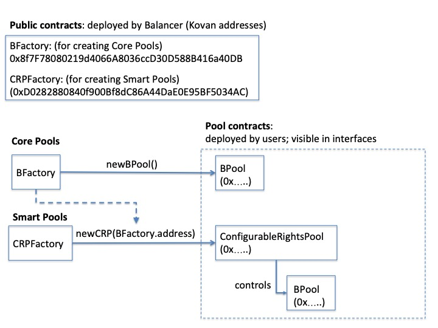

# This page has been deprecated. V1 documentation is partially maintained [here](https://docs.balancer.fi/v/v1/protocol/concepts)

# Core Concepts

## Terminology

* **Core Pool**: A `BPool` contract object - this is the "base" pool that actually holds the tokens
* **Balance**: The total token balance of a pool. Does not refer to any user balance.
* **Denorm**: Denormalized weight. Weights on a BPool, though often displayed as percentages, are configured and stored in their **denormalized** form. For instance, in a two-token pool with denormalized weights of A=38 and B=2, token A's percentage weight would be 38/\(38+2\), or 95%. Conversely, token B's proportion would be 2/\(38+2\), or 5%.
* **Controller**: The pool's "owner"; an address that can call `CONTROL` capabilities.
* **Factory**: The official BPool factory. Pools deployed from this factory appear on Balancer user interfaces \(e.g., the [Exchange](https://balancer.exchange/#/swap) and [Pool Manager](https://pools.balancer.exchange/#/)\).
* **Smart Pool**: A contract that owns \(i.e., is the **controller\)**, ****of a **Core** **Pool**. Much more about these later.

## Pool Lifecycle

Any user can create a new pool by calling `newBPool()` on the `BFactory` contract. The caller is set as the `controller` or pool owner.

Pools can exist in one of two states: `controlled` or `finalized`. Pools start in a controlled state and the controller may choose to make the pool finalized by calling `finalize()`. Finalize is a one-way transition. While in a controlled state, outside actors cannot add liquidity. A controlled state allows the controller to set the pool's tokens and weights.

### Smart Contract Owned Controlled Pools \("Smart Pools"\)

One very powerful feature of Balancer is the concept of Smart Pools. A smart contract controlled pool can fully emulate a finalized pool, while also allowing complex logic to readjust balances, weights, and fees. Some examples include:

* [An interest bearing stablecoin pool without impermanent loss](https://medium.com/balancer-protocol/zero-impermanent-loss-stablecoin-pool-with-lending-interests-a3da6d8bb782)
* A pool that adjusts swap fees as a function of the volatility of the pool's assets
* A pool that updates weights to implement a particular market strategy \(e.g., a [Liquidity Bootstrapping Pool](https://balancer.finance/2020/03/04/building-liquidity-into-token-distribution/)\).
* More complex [dynamic strategies](https://caia.org/sites/default/files/dynamic_strategies_for_asset_allocation.pdf) for asset allocation

For clarity, here is a graphical representation of the process for creating both Core Pools and Smart Pools - it can be a little confusing keeping all the addresses straight!

In a nutshell, Balancer has deployed Factory contracts for creating pools. Users deploy new pool contracts by calling create methods on these factories. In both cases, the actual "pool" visible to traders on the public interfaces is a new BPool contract.

If you deploy a Core Pool directly, you are the controller of that pool. If you deploy a Smart Pool, you need to pass in the core BFactory address, since two contracts will be deployed. You are the controller of the Smart Pool - and the Smart Pool itself is the controller of the BPool.

#### Conceptual Capabilities

There are three categories of things you can do with pools.

* **Trade** - using the swap functions
* **Provide liquidity** - using the join/exit pool functions \(both single- and multi-asset entry and exit are supported\)
* **Manage the pool** - if you are the controller \(e.g., change its parameters\)

Core Pools can only be managed until "finalized," after which their parameters are immutable.

Smart Pools are managed according to the rights granted to the controller on creation. For instance, you can create a Smart Pool where the weights can be changed, but the swap fee and token composition are fixed.

* `SWAP`  \(`swap_*`, `joinswap_*`, `exitswap_*`\)
* `JOIN` \(`joinPool`, `joinswap_*`\)
* `EXIT` \(`exitPool`, `exitswap_*`\)
* `CONTROL` \(`bind`, `unbind`, `rebind`, `setSwapFee`, `finalize`\)

Notice that e.g. `joinswap` requires both `JOIN` and `SWAP`.

