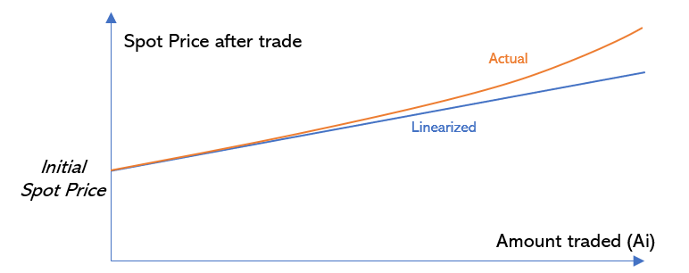
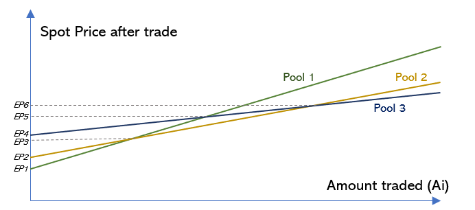
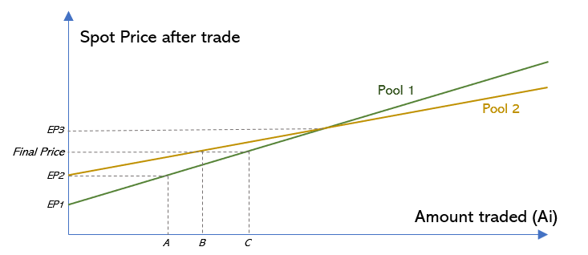

# This page has been deprecated. V1 documentation is partially maintained [here](https://docs.balancer.fi/v/v1/protocol/sor/)

# SOR

## Overview

Smart Order Router, or SOR, is an off-chain linear optimization of routing orders across pools for best price execution. It takes as input a desired amount of any token to be traded for another token and returns a list of pools/amounts that should be traded such that the amount of returned tokens is maximized. The sum of the amounts to be traded with each pool equals the desired amount given as input.

SOR exists in the Bronze release as a way to aggregate liquidity across all Balancer pools. Future releases of Balancer will accomplish this on-chain and allow aggregate contract fillable liquidity.

Liquidity aggregators are free to use the SOR npm package or create their own order routing across pools.

## Motivation

Since there might be many Balancer pools that contain a given pair, trading only with the most liquid pool is not ideal. The fact that after a one-pool-trade arbitrageurs can profit by leveling all pool prices means the one-pool trader left value on the table.

The ideal solution in a world where there were no gas costs or gas limits would be to trade with all pools available in the desired pair. The amount traded with each pool should move them all to the same new spot price. This would mean all pools would be in an arbitrage free state and no value could be further extracted by arbitrageurs \(which always comes at the expense of the trader\).

As there are incremental gas costs associated with interacting with each additional Balancer pool, SOR makes sure that the increase in the returns an incremental pool brings exceeds the incremental gas costs. This is an optimization problem that depends therefore on the gas fees paid to the ethereum network: a higher gas price may cause SOR to select less pools than otherwise.

## How it works

The fundamental optimization SOR seeks to solve is to find a set of Balancer pools to interact with such that, considering gas costs, there is no additional pool that could be added to that set such that the returns of the trade would be increased.

### Linearization

Even though SOR runs totally off-chain, it has been designed to be EVM-tractable, since our idea is to release an on-chain version in the future.

In order to make SOR EVM-tractable, the function that calculates the spot price of a Balancer pool after a given amount is traded \(the price increases due to slippage\) has been linearized for our algorithm. We refer to EP – the estimated price – as the spot price a pool will have after a trade according to that linearized approximation. The figure below shows the real spot price after a given amount is traded \(non-linear\) versus its linearized approximation which we use.

### Prices of interest

Since we linearize the spot price functions of all Balancer pools, we can interpolate prices and amounts to make our optimization solution simpler. 

To help visualize what this means, imagine there are 3 Balancer pools that contain a pair of tokens that SOR has to find a solution for. We define EPs of interest as the sets of prices where either:

1. there is a pool with that initial spot price; or
2. the spot prices of two pools cross at that price.

The figure below shows the 6 different EPs of interest for that case.

### Solution example

To reduce clutter and simplify the visualization, we consider only pools 1 and 2 for the following walk through.

Let _A_ be the amount of _token in_  to be traded on pool 1 such that its price increases from EP1 \(initial spot price of pool 1\) to EP2 \(initial spot price of pool 2\). The solution of SOR for any amount of tokens lower than _A_ is simply: "trade all the amount desired with pool 1".

When the amount traded is greater than _A,_ SOR will start including pool 2 in the solution as not doing so would mean the trader is trading some amount \(what goes beyond _A_\) for a higher price than they could \(with pool 2\).

The solution for trading an amount B+C can be found by interpolating the trades that result in EP2 and EP3. By trading C with pool 1 and B with pool 2, both pools end at the same price \(Final Price\) which means that the best solution was found. 

